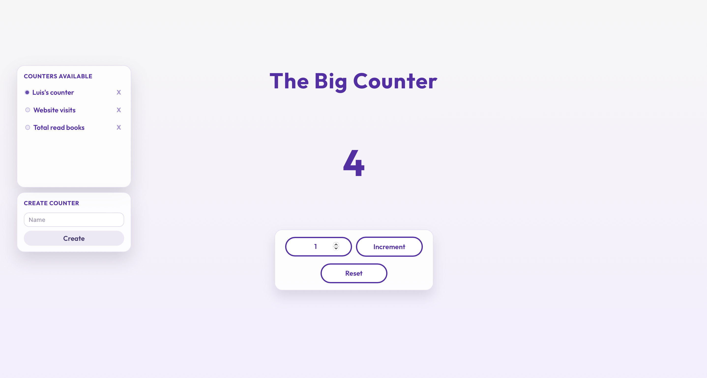

# The Big Counter (Front-end)

Web interface to manage counters: list, create, select, increment with a custom value, and reset.

## Stack

- React 19
- TypeScript
- Vite

## Scripts

- `npm run dev` - development server
- `npm run build` - production build
- `npm run preview` - preview the build
- `npm run lint` - lint the code
